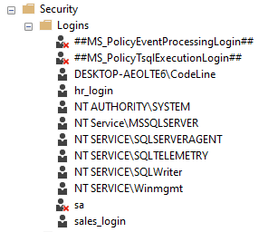
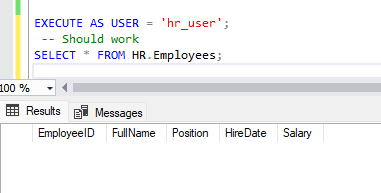
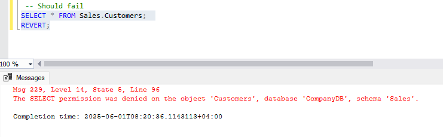

# Enforcing Schema Level Access in a Company Database

**Task: Enforcing Schema-Level Access in a Company Database**

**Scenario**

You are the database administrator of a system that contains two main departments: 

• HR (Human Resources) 

• Sales 

Your job is to restrict access so that each department only views and works with its own data. 

**Objective**

1. Create SQL logins and map them to users inside the database. 

```sql
-- Step 1: Create the database
CREATE DATABASE CompanyDB;

-- Use the new database
USE CompanyDB


-- Create login and user for HR department
CREATE LOGIN hr_login WITH PASSWORD = 'Hr@12345';
CREATE USER hr_user FOR LOGIN hr_login;

-- Create login and user for Sales department
CREATE LOGIN sales_login WITH PASSWORD = 'Sales@12345';
CREATE USER sales_user FOR LOGIN sales_login;
```





2. Create two schemas: HR and Sales. 


```sql

-- Create HR schema
CREATE SCHEMA HR;


-- Create Sales schema
CREATE SCHEMA Sales;

```


3. Create a few sample tables inside each schema. 

```sql
-- HR.Employees table
CREATE TABLE HR.Employees (
    EmployeeID INT PRIMARY KEY,
    FullName NVARCHAR(100),
    Position NVARCHAR(50),
    HireDate DATE,
    Salary DECIMAL(10, 2)
);

-- HR.Departments table
CREATE TABLE HR.Departments (
    DepartmentID INT PRIMARY KEY,
    DepartmentName NVARCHAR(100),
    ManagerID INT
);

-- Sales.Customers table
CREATE TABLE Sales.Customers (
    CustomerID INT PRIMARY KEY,
    CustomerName NVARCHAR(100),
    Email NVARCHAR(100),
    Region NVARCHAR(50)
);

-- Sales.Orders table
CREATE TABLE Sales.Orders (
    OrderID INT PRIMARY KEY,
    CustomerID INT,
    OrderDate DATE,
    TotalAmount DECIMAL(10, 2),
    FOREIGN KEY (CustomerID) REFERENCES Sales.Customers(CustomerID)
);
```


4. Assign schema-level permissions so: 

 - HR users cannot access Sales data.

    ```sql
    -- Give HR user full access to HR schema
    GRANT SELECT, INSERT, UPDATE, DELETE ON SCHEMA::HR TO hr_user;
    -- Prevent HR user from accessing Sales schema
    DENY SELECT, INSERT, UPDATE, DELETE ON SCHEMA::Sales TO hr_user;

    ```

	
- Sales users cannot access HR data. 
- 
    ```sql
    -- Give Sales user full access to Sales schema
    GRANT SELECT, INSERT, UPDATE, DELETE ON SCHEMA::Sales TO sales_user;
    -- Prevent Sales user from accessing HR schema
    DENY SELECT, INSERT, UPDATE, DELETE ON SCHEMA::HR TO sales_user;
    ```


**Task Output Checklist**

   - Try to:
1. Connect as hr_login and access HR.Employees ( should work)


2. Try to access Sales.Customers ( should be denied)



3. Write a short explanation:
- Why schema-level security is better than table-by-table permissions
    - Schema-level security allow to manage permissions at the schema level instead of individual tables
    but the table-by-table permissions require access to each table one by one, and apply permissions to the entire schema .
- How this setup supports data segregation in real-world companies
    - This setup ensures that each department can only access its own data, preventing unauthorized access and maintaining data integrity. It allows for clear separation of concerns, which is crucial in environments where sensitive information is handled, such as HR and Sales.


------------
# Reflection Report Instructions
## Understanding SQL Security Levels and Real-World Risks

**1. What are SQL Security Levels?**

**Explain:**

   • **Server-level login** -> This is the highest level of security in SQL Server, where users are authenticated at the server level. It allows access to the SQL Server instance itself.

   • **Database-level user** -> This is a user that is created within a specific database, allowing access to that database's objects and data.
   
   • **Schema-level permissions** -> This allows for grouping of database objects and managing permissions at the schema level, which is more efficient than managing permissions on individual tables.
   
   • **Object-level permissions** -> This allows for fine-grained control over specific database objects, such as tables or views, enabling or restricting access to those objects for specific users or roles.

**2. Benefits of Applying Security Levels**

• Protect sensitive data from unauthorized access

• Ensure data integrity by preventing unauthorized modifications

• Control user access to specific data and operations

• Simplify permission management by grouping objects into schemas


**3. Real-World Risks Without Security**

**Explain what might happen if:**

• **Everyone has full access** -> This can lead to data breaches, unauthorized modifications, and loss of sensitive information. Employees could access and manipulate data they are not authorized to view or change.

• **Developers modify production data** -> This can result in data corruption, loss of critical information, and disruption of business operations. It can also lead to compliance issues if sensitive data is altered or deleted without proper authorization.

• **Interns access HR data**  -> This can lead to privacy violations, as interns may not have the necessary training or understanding of data sensitivity. They could inadvertently expose or misuse personal information of employees, leading to legal and ethical issues for the company.


----------------

#  Security Risk Report : The Overpowered Developer

**Scenario:** **"The Overpowered Developer"**

You’re part of a company building an internal Payroll Management System. During
development, a database developer named Adil was given full control on the production
database to “speed up” testing and updates. However, the following problems occurred:

**What Went Wrong**

**1. Accidental Data Deletion**

- Adil ran a DELETE FROM Employees command thinking he was connected to the
test database.
- No backup was taken before running the query.

**2. Salary Data Leaked**

- Adil created a report for testing that included all employee salaries.

- He shared the exported Excel file with an external UI developer by mistake.
**3. Unauthorized Role Creation**
- To “help,” Adil created a new SQL login for a junior developer without informing
the DB admin.

- The junior dev used that login to explore the entire database, including sensitive
HR data.

**4. Schema Confusion**
- Adil created new tables inside the wrong schema (dbo instead of HR) which
caused permission issues for HR team users.

**Trainee Reflection Task: Security Analysis Report**
**Your Job:** Analyze the above scenario and write a Security Risk Report with the following points.

## Report Sections

**1. Summary of the Problems**

List and describe what went wrong (based on the points above).

**A. Accidental Data Deletion**

Adil accidentally executed a DELETE FROM Employees statement on the production database, thinking he was working in a test environment. No backup existed to recover the deleted records.

**B. Salary Data Leaked**

Adil exported a test report containing employee salary details and mistakenly shared it with an external UI developer, violating data confidentiality.

**C. Unauthorized Role Creation**

Adil created a SQL login for a junior developer without informing the DBA. This login gave the junior developer unrestricted access to the full database, including sensitive HR records.

**D. Schema Confusion**

Adil created new tables under the dbo schema instead of the correct HR schema, which resulted in permission issues for HR users who lacked access to the dbo schema.


**2. Root Causes**

**Identify the security flaws:**

**• No separation between development and production**

Adil was allowed to test directly in the production environment, which led to accidental data loss and exposure of sensitive information.

**• Full access given to developers** 

Adil had full control over the production database, including data manipulation and user management.

**• No schema-level restrictions**

There were no schema-level restrictions, allowing Adil to create and modify objects in any schema without oversight. This led to confusion and permission issues for the HR team.

**• Lack of role-based permission control**

Adil had unrestricted access to create roles and logins, which allowed him to grant excessive permissions to other users without proper authorization or oversight.


**3. Suggested Solutions**

Explain how these issues could have been avoided using:
• Schema-level permissions
• Separation of roles (e.g., read-only, data entry)
• Use of views to hide sensitive columns
• Audit logs or restricted role creation
• Environment separation (dev vs prod)

**4. Lessons Learned**

• What should developers have access to?
• What should be restricted to DBAs or admins?
• Why is "minimum privilege" important?

**Bonus Activity (Optional)**

**simulate:**

• Creating a role like ReadOnly_Dev and granting only SELECT on a schema.
• Trying to run an INSERT or DELETE command using that limited role to observe
permission denial.