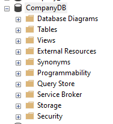
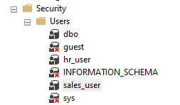
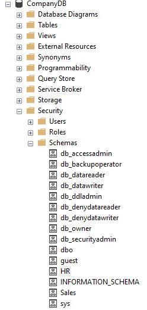

# Enforcing Schema Level Access in a Company Database

**Task: Enforcing Schema-Level Access in a Company Database**

**Scenario**

You are the database administrator of a system that contains two main departments: 

• HR (Human Resources) 

• Sales 

Your job is to restrict access so that each department only views and works with its own data. 

**Objective**

1. Create SQL logins and map them to users inside the database. 

```sql
-- Step 1: Create the database
CREATE DATABASE CompanyDB;

-- Use the new database
USE CompanyDB


-- Create login and user for HR department
CREATE LOGIN hr_login WITH PASSWORD = 'Hr@12345';
CREATE USER hr_user FOR LOGIN hr_login;

-- Create login and user for Sales department
CREATE LOGIN sales_login WITH PASSWORD = 'Sales@12345';
CREATE USER sales_user FOR LOGIN sales_login;
```





2. Create two schemas: HR and Sales. 


```sql

-- Create HR schema
CREATE SCHEMA HR;


-- Create Sales schema
CREATE SCHEMA Sales;

```


