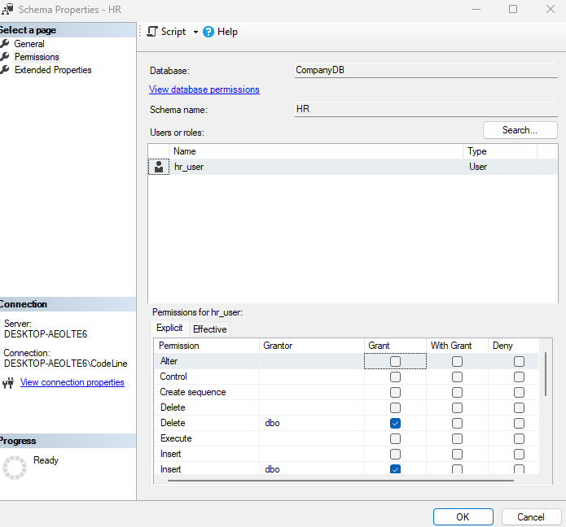

# Enforcing Schema Level Access in a Company Database

**Task: Enforcing Schema-Level Access in a Company Database**

**Scenario**

You are the database administrator of a system that contains two main departments: 

• HR (Human Resources) 

• Sales 

Your job is to restrict access so that each department only views and works with its own data. 

**Objective**

1. Create SQL logins and map them to users inside the database. 

```sql
-- Step 1: Create the database
CREATE DATABASE CompanyDB;

-- Use the new database
USE CompanyDB


-- Create login and user for HR department
CREATE LOGIN hr_login WITH PASSWORD = 'Hr@12345';
CREATE USER hr_user FOR LOGIN hr_login;

-- Create login and user for Sales department
CREATE LOGIN sales_login WITH PASSWORD = 'Sales@12345';
CREATE USER sales_user FOR LOGIN sales_login;
```


2. Create two schemas: HR and Sales. 


```sql

-- Create HR schema
CREATE SCHEMA HR;


-- Create Sales schema
CREATE SCHEMA Sales;

```


3. Create a few sample tables inside each schema. 

```sql
-- HR.Employees table
CREATE TABLE HR.Employees (
    EmployeeID INT PRIMARY KEY,
    FullName NVARCHAR(100),
    Position NVARCHAR(50),
    HireDate DATE,
    Salary DECIMAL(10, 2)
);

-- HR.Departments table
CREATE TABLE HR.Departments (
    DepartmentID INT PRIMARY KEY,
    DepartmentName NVARCHAR(100),
    ManagerID INT
);

-- Sales.Customers table
CREATE TABLE Sales.Customers (
    CustomerID INT PRIMARY KEY,
    CustomerName NVARCHAR(100),
    Email NVARCHAR(100),
    Region NVARCHAR(50)
);

-- Sales.Orders table
CREATE TABLE Sales.Orders (
    OrderID INT PRIMARY KEY,
    CustomerID INT,
    OrderDate DATE,
    TotalAmount DECIMAL(10, 2),
    FOREIGN KEY (CustomerID) REFERENCES Sales.Customers(CustomerID)
);
```


-- 4. Assign schema-level permissions so: 
	-- o HR users cannot access Sales data.

    ```sql
    -- Give HR user full access to HR schema
    GRANT SELECT, INSERT, UPDATE, DELETE ON SCHEMA::HR TO hr_user;
    -- Prevent HR user from accessing Sales schema
    DENY SELECT, INSERT, UPDATE, DELETE ON SCHEMA::Sales TO hr_user;

    ```

	

	-- o Sales users cannot access HR data. 

    ```sql
    -- Give Sales user full access to Sales schema
    GRANT SELECT, INSERT, UPDATE, DELETE ON SCHEMA::Sales TO sales_user;
    -- Prevent Sales user from accessing HR schema
    DENY SELECT, INSERT, UPDATE, DELETE ON SCHEMA::HR TO sales_user;
    ```


